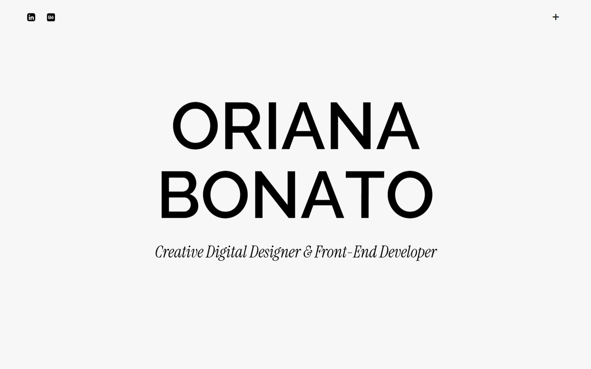

# Oriana Bonato — Portfolio



Personal portfolio of **Oriana Bonato**, a graphic / digital designer and front-end developer. A single-page site with per-project detail pages, built with **vanilla HTML, CSS and JavaScript** — no frameworks, no build step.

🔗 **Live:** https://orianabonato.github.io/web_portfolio/

---

## ✨ Features

- **Bilingual (EN / ES)** — custom i18n system with a JS dictionary; the chosen language is persisted in `localStorage`. It translates text, HTML and attributes (including the CV button, which downloads the PDF matching the active language).
- **Fullscreen curtain menu** — fixed top bar with a "+" toggle, `clip-path` reveal overlay, and scroll-spy for the active section.
- **Split-scroll galleries** — on the home (portfolio) and on each project detail page, scrolling drives sticky animations computed in JS. Several gallery modes:
  - square 1:1 image that never crops,
  - tall web screenshots with vertical *pan*,
  - continuous strip for photos of differing heights,
  - final square "Visit website" CTA.
- **Scroll-reveal animations** (fade, rise, per-letter title split) via `IntersectionObserver`; honours `prefers-reduced-motion`.
- **Custom cursor** — a circle using `mix-blend-mode` (always visible over light and dark) with smooth easing; over the tools marquee it morphs into a label showing the program name.
- **Responsive** (≤768px) — single-column layout; the split-scroll modules are disabled on mobile and the detail pages use a fixed progress bar.
- **Optimized images** — served as WebP; the uncompressed originals are kept out of the deploy.

---

## 🛠️ Tech stack

- HTML5 · CSS3 · JavaScript (ES6+), zero dependencies, no bundler.
- Fonts: [Raleway](https://fonts.google.com/specimen/Raleway) and [Instrument Serif](https://fonts.google.com/specimen/Instrument+Serif) (Google Fonts).
- Hosting: **GitHub Pages** (`master` branch, repo root).

---

## 📁 Structure

```
.
├── index.html            # home (single page: hero, services, portfolio, about, experience, footer)
├── project-01.html …     # project detail pages (project-01 … project-06)
├── project-06.html
├── styles.css            # all styles (responsive media queries at the end)
├── script.js             # all logic: split-scroll, i18n, reveal, cursor, nav, responsive
├── img/                  # .webp images (deploy), SVG icons, logos, portrait, CV, preview
│   ├── icons/            # social + tool icons
│   ├── cards-projects/   # logos for the home cards
│   ├── GOCHO/ …          # per-project images
│   └── CV_OrianaBonato_2026_{EN,ES}.pdf
├── .gitignore
└── README.md
```

> `_originales/` (outside the repo, ignored in `.gitignore`) holds the uncompressed PNGs of the project images. The site only uses the `.webp` versions.

---

## 🚀 Run locally

There's no build. Just serve the folder with any static server:

```bash
# quick option with Python
python -m http.server 8000
# or with Node
npx serve .
```

Then open `http://localhost:8000`. (Opening `index.html` directly also works, though a static server matches production behaviour more closely.)

---

## 🧩 Architecture notes

- **No per-page HTML for global features**: the nav, custom cursor, mobile progress bar, i18n and translations all live in `script.js`, which is shared across the 8 pages. Each module is an IIFE that bails out early if its target element isn't in the DOM.
- **i18n**: English lives in the HTML (default language); Spanish lives in the `script.js` dictionary. Translatable elements are tagged with `data-i18n`, `data-i18n-html` or `data-i18n-href`.
- **Adaptive split-scroll**: the home carousel derives its steps from the number of cards present, so commenting a project in or out doesn't break the animation.

---

## 👤 Author

**Oriana Bonato** — Creative Digital Designer & Front-End Developer
[LinkedIn](https://www.linkedin.com/in/oriana-bonato/) · [Behance](https://www.behance.net/ocbonato96)